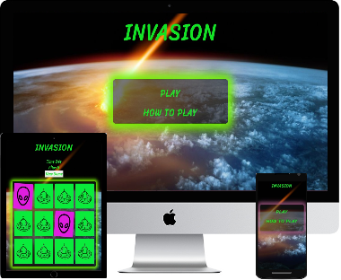
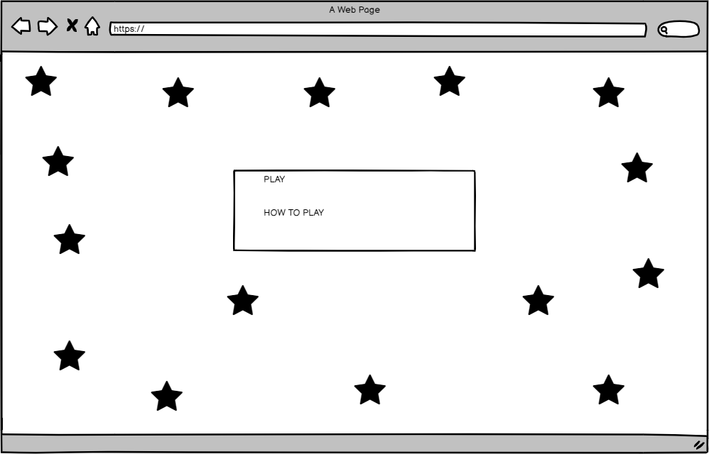
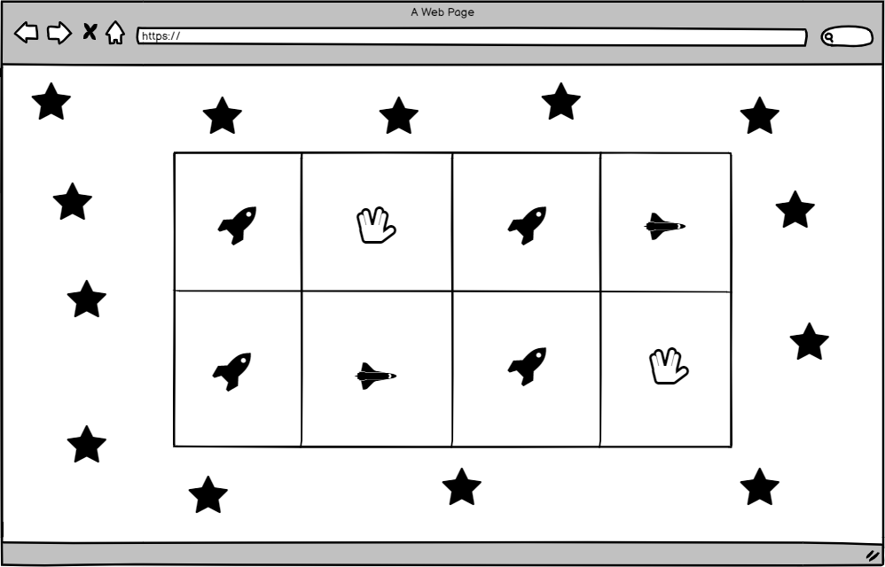
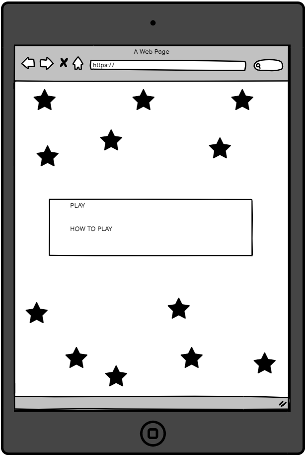
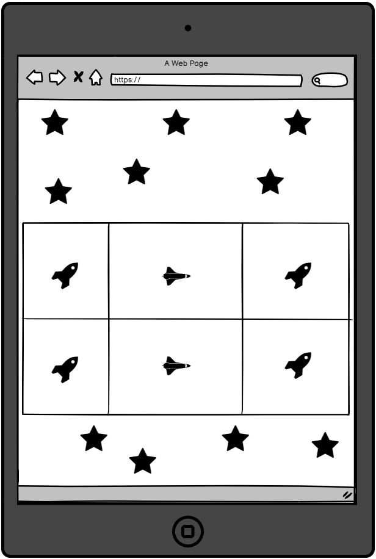
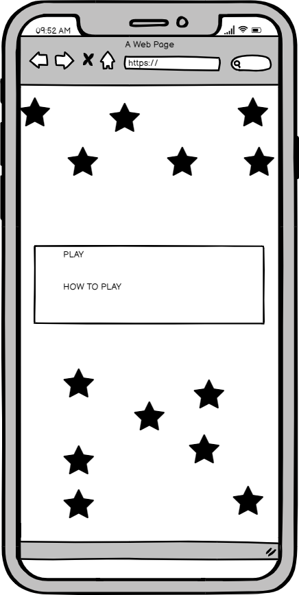
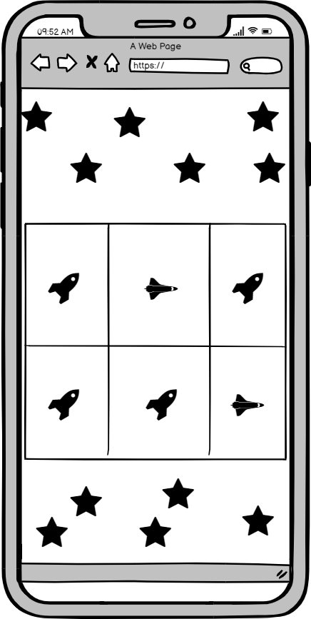

# "Invasion" Javascript memory game 

This project is a Alien outer space themed interactive memory game. This memory card game can be played on either desktop, ipad/tablet and iphone/mobile.

You can view the live website here - https://sidhowes.github.io/Invasion/

### Desktops 

  

## UX

* Once game has loaded the user will be on the home page with alien themed pictures and moving lights.
* The user should be able to click on the "how to play" and a pop up will appear with instructions on how to play the game.
* The user should be able to click on the "x" in the top right corner of the pop up in order to hide the instructions.  
* The user should be able to access the game screen once clicked on "play".
* Now on the game page the user will notice the alien theme is used throughout the game.
* The user should be able to click on the cards to flip the cards over in order to match another card.
* The user will notice that once two cards have matched, they will stay flipped and slightly moving so that it is clear that the cards have matched.
* The user will notice that if cards do not match they will flip back over and the game will continue until all cards have been matched.
* The user should be able to flip the cards in the least amount of flips and within the 60s timer. For the best score it would be the least amount of flips within the quickest amount of time.
* The user should be able see there final score and time at end of the game in order to try and beat it in the future.
* The user should be able to click on the "New game" button in order to restart the game.

### **Wireframes** 

### Home page desktop

  

### Game page desktop

  

### Home page ipad

  

### Game page ipad

  

### Home page iphone

  

### Game page iphone

  

## Features 

* "How to play" pop up - allows the user to acess information on the game Instructions.
*  Memory Game - allows users to click on the cards and play with the game. 
*  New Game - allows users to start a new game anytime. 
* Countdown timer - Count down from 60s to 0s to let the user know how fast they completed the game.

### Features for the future

* Highscore - A highscore table to show previous scores ranked from best to worse.

## Technologies Used

### Languages

* HTML: The language used for the inital content of website.
* CSS: Cascading style sheet language, to style the project (_to make the project come alive_)
* Javascript: the language used a give the project interactivity.

### Tools 

* [Balsamiq wireframes](https://balsamiq.com/) : Used to create the wireframes at the planning UX stage of the project.
* [Github](https://www.github.com/): Used to host the repositories for the website.
* [Google Fonts](https://fonts.google.com/): Used to get fonts used for my text _Lato_ and headings _Sriracha_. 
* [Font Awesome](https://fontawesome.com/) - Used font awesome icons to style the card back and card front of the memory game.
* [jQuery](https://jquery.com/) - jQuery was used to open and hide the pop up window and to remove the visible class in my overlay. Jquery was used alongside Javascript throughout the project.
* [W3Cschools css validator](https://jigsaw.w3.org/css-validator/validator) - Validate my css code to make sure there are no errors.
* [W3Cschools html validator](https://validator.w3.org/) - Validate my html code to make sure there are no errors.

## Testing

Using Chrome developer tools throughout the project to test how the the project looks on desktop and on smaller devices i.e
mobile device.
Whenever a change was made I used the selector tool and open up the browser to see that change and to see how it would look.
Another testing method was the inspect selector on the opened browser and although it does not save the changes made while using this 
testing method it is a quick way to see how elements look when moved around.
Lastly a testing method useed was my own by playing the game a number of times to make sure the game functions as intended.

### Problems encoutered when testing

A problem that was encoutered and solved during the project was when I wanted the cards that have been matched to spin they would not stay 
facing card front but flipped back to card back. In order to resolve this I rotated the cards on the "Z" axis which this did reslove the issue and cards stayed 
facing card front.
 

## Deployment

My website is hosted on Github pages, following these steps to deploy the website.

### Github pages
1. Navagate to my gitbug respository -  https://github.com/Sidhowes/Invasion
2. Click on **settings** top right of the page.
3. Scroll down to **Github pages**.
4. click on the dropdown menu of**Source**.
5. Select **master branch**
6. Refresh your page.
7. A green box with a tick is now shown to show that it has been published.

## Credits

### Content

* Javascript Code for pop up "How to play" box - [w3schools](https://www.w3schools.com/js/js_popup.asp)
* CSS Code for pop up "How to play" box - [w3schools](https://www.w3schools.com/howto/howto_js_popup.asp)
* Code inspiration for a flip counter - [stack overflow](https://stackoverflow.com/questions/746353/javascript-flip-counter)

### Media

* All images used from [Google images](https://www.google.com/search?q=meteor+towards+earth&tbm=isch&ved=2ahUKEwijnMeT4MrrAhVPYxoKHS_IBJEQ2-cCegQIABAA&oq=meteor+towards+earth&gs_lcp=CgNpbWcQAzICCAAyBggAEAgQHjIGCAAQCBAeMgYIABAIEB4yBggAEAgQHjIGCAAQCBAeMgYIABAIEB4yBAgAEBgyBAgAEBg6BAgAEEM6BwgAELEDEEM6BQgAELEDOgYIABAFEB5Q6H5Y5bMBYO63AWgCcAB4AIABWIgB2wmSAQIyMpgBAKABAaoBC2d3cy13aXotaW1nwAEB&sclient=img&ei=crVPX6ObPM_Gaa-Qk4gJ&bih=625&biw=1366)
  
### Acknowlegements 

* Help and guidance from my mentor _Akshat Grag_.
* inspiration from: 
  * [youtube](https://www.youtube.com/watch?v=bbb9dZotsOc)

